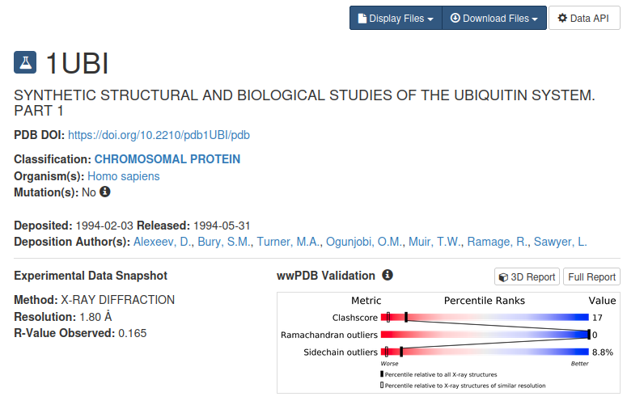
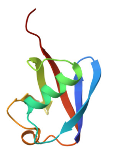

# MD Simulation of Ubiquitin with AMBER25


This tutorial aims to provide a comprehensive introduction to classical molecular dynamics simulations using the Amber software package. Amber is a widely used tool for simulating biomolecular systems at the atomic level, enabling researchers to investigate a wide range of phenomena, including protein folding, ligand-protein interactions, and enzyme catalysis.
This tutorial focuses on a small protein, **Ubiquitin**, which will be simulated for a time of **100 ns**. Ubiquitin is a well-studied protein involved in various cellular processes, making it a suitable example for learning molecular dynamics simulations using Amber 2025.

---

## Step 1: Retrieve the Structure

The Protein Data Bank (PDB) is a repository of three-dimensional structures of macromolecules, such as proteins and nucleic acids. To download the ubiquitin protein structure (PDB ID: **1UBI**), follow these steps:

1. **Access the PDB website:** Open a web browser and navigate to the [RCSB PDB website](https://www.rcsb.org/).
2. **Search for the structure:** Use the ID `1UBI` in the search bar.
3. **Download the PDB file:** On the structure page, locate the **"Download Files"** section and click on **"PDB Legacy"** to download the file.
4. **Save the PDB file:** Choose a location on your computer. The file will typically be named `1UBI.pdb`.

<p align="center">
    
  </a>
  
</p>

---

## Step 2: Cleaning the PDB File for Topology Preparation

The PDB file must be prepared for simulation before moving forward. It is highly recommended to **keep an unaltered copy** of the downloaded PDB file as a reference in case you encounter problems during the preparation or simulation process.

* **Clean the file:** `CONECT` records define connectivity between atoms, but AMBER utilizes its own internal bonding information. Remove all `CONECT` lines from the PDB.
* **Add structural records:** Ensure all necessary `TER` records are present to mark the end of a chain, as well as an `END` record at the very termination of the file.
* **Strip all hydrogen atoms:** It is recommended to let AMBER add hydrogen atoms to the structure to prevent atom-naming conflicts. Remove existing hydrogens using a text editor (e.g., VS Code, Gedit) or programs like PyMOL or VMD.
* **Always visualize the file:** Open the cleaned file in VMD to verify that there are no strange bonds or incorrect visualizations before proceeding.

---

## Step 3: Building Topology Using the TLeap Module

Once you have the prepared PDB, you can pass it to the **TLeap** module for topology construction. TLeap is a powerful tool within the Amber suite designed for preparing molecular systems by manipulating and modifying molecular structures. For more information, visit the [Amber TLeap Tutorial](https://ambermd.org/tutorials/pengfei).

For this tutorial, it is recommended to open TLeap in your terminal and type one command at a time to understand the workflow:

```bash
tleap
```

The workflow has a setting like this:

* **Load** all the necessary force field (FF): this loading ALWAYS depend on the type of molecules present in the PDB you are using. If there are only proteins, it must be load only the protein FF (protein.ff19SB). If there are proteins and RNA, FFs of proteins and RNA(RNA.OL3) must be loaded. After the loading of all necessary FF, also the FF for water (water.TIP3P) must be loaded to solvate the complex.
* **All force fields available for AMBER25 are at the following** [link](https://ambermd.org/)
* To load the FF for proteins, use the command:

```bash
source leaprc.protein.ff19SB
```

* **Load** the PDB. The PBD must be loaded using a variable name and the loadpdb command, as follows:

```bash
pdb = loadpdb yourpdb.pdb
```

* **Check** the loaded PDB file for any errors using the check command:

```bash
check
```

* **Check** the charge of the loaded pdb using the charge command (keep in mind the charge of the complex under examination)

```bash
charge
```

* **Save** the AMBER processed PDB without water using the savepdb command:

```bash
savepdb pdb yourfile_nowat.pdb
```

* **Save** prmtop (topology file) and rst7 (coordinates file) without water using the saveamberparms command:

```bash
saveamberparms pdb yourfile_nowat.prmtop yourfile_nowat.rst7
```

* **Solvate** the system. The solvateOct command is used in the link below, but for now it is preferred a cubic box. Therefore, the command shown must be used:

```bash
solvateBox pdb TIP3PBOX padding
```

* The padding is a number and represents the thickness of water to be inserted around the complex. A minimum padding of 10.0 angstroms is required.

* **Neutralize** the system by adding counterions. Keeping track of the system's charge, use the command:

```bash
addIons pdb Ion 0
```

* For Ion use Na+/K+ or Cl- based on the system's charge. The 0 at the end of the command indicates that the total charge must be 0, therefore neutral. TLeap will replace water molecules with the necessary ions.
* **Save** the hydrated and ionized PDB using the savepdb command
* **Save** the hydrated and ionized prmtop and rst7 using the saveamberparms command

The prmtop is a common file format used to store protein topology information. This information includes the types of atoms in the protein, their positions, and their connections to each other. The rst7 is a less common file format that is also used to store protein topology information. It is typically used in conjunction with the prmtop file to provide additional information about the protein structure.
The topology refers to the arrangement of atoms in a molecule. This information is important for understanding how the molecule functions. The coordinates refer to the positions of the atoms in a molecule. This information is important for visualizing the molecule and understanding its structure.
For some specifications, please refer to the [link](https://ambermd.org/tutorials/)

